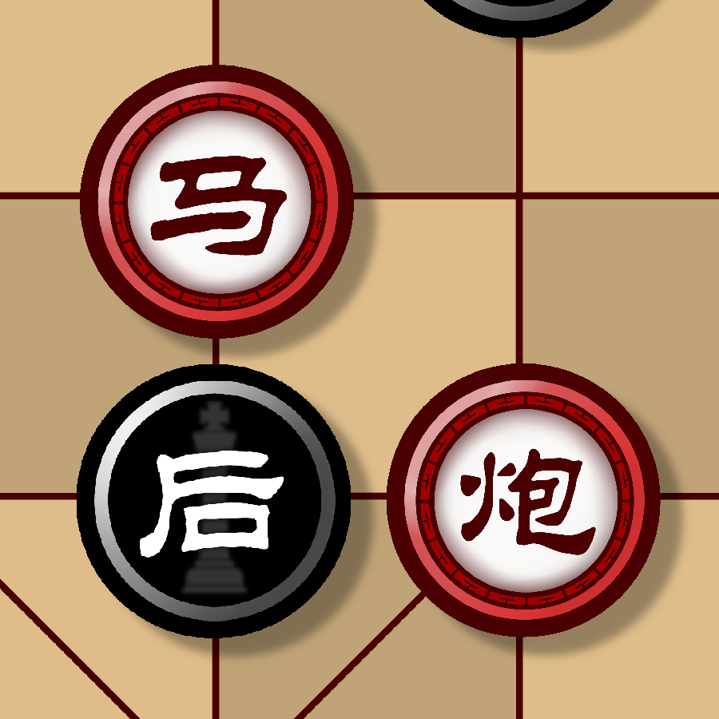

# 破readme还没造完

# BingGo
简介

[
EN
](README_en.md)

  

<h3 align="center">BingGo</h3>

  简介
   
  <a href="https://baidu.com"><strong>探索本项目的文档 »</strong></a>
     
  <a href="https://github.com/windbell0711/BingGo">查看Demo</a>  ·
  <a href="https://github.com/windbell0711/BingGo/issues">报告Bug</a>  ·
  <a href="https://github.com/windbell0711/BingGo/issues">提出新特性</a>

 
## 目录

## 游戏安装
## 玩法介绍
## 规则介绍
## 作者
## 技术信息
## 版权说明
