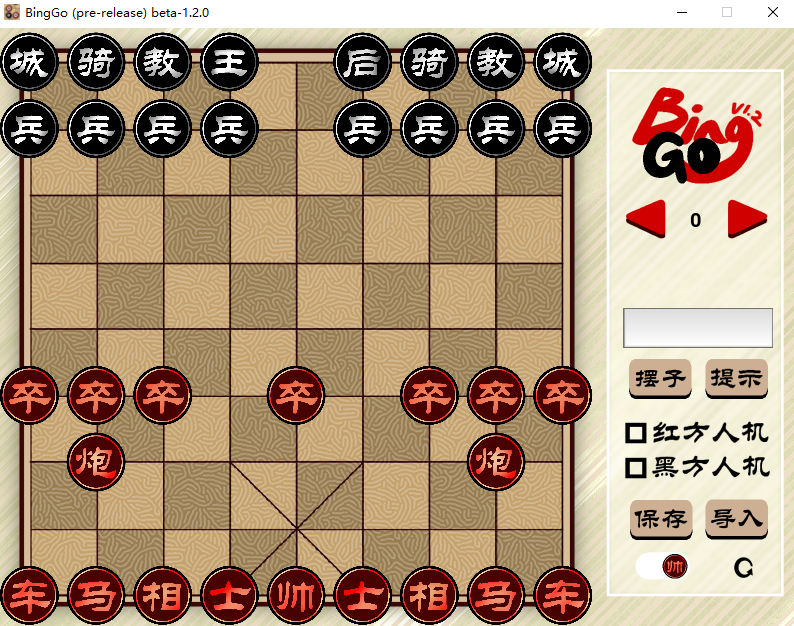
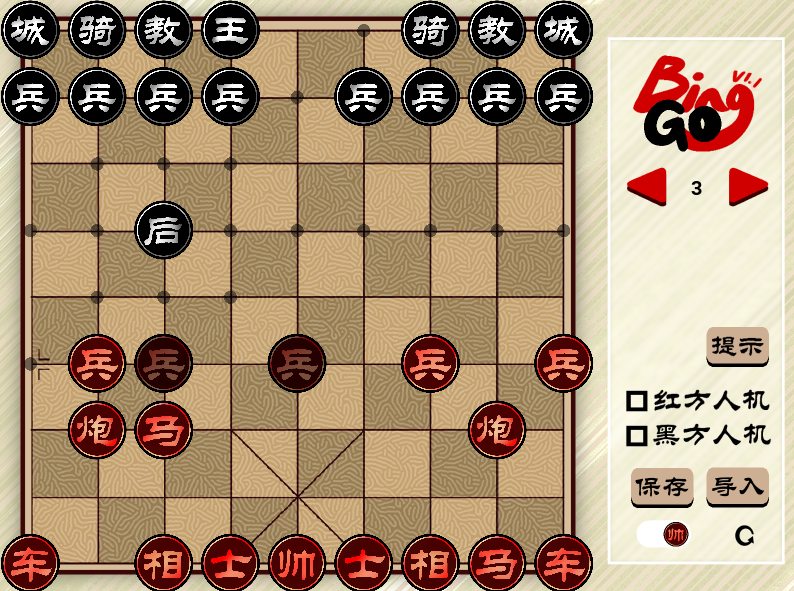

# BingGo

  <a href="https://github.com/windbelljianjie0711/BingGo/README_en.md">EN</a> · 
  <a href="https://github.com/windbelljianjie0711/BingGo/README_tech.md">技术文档</a>

挺兵！将中国象棋和国际象棋的玩法结合，9×9的棋局中，中象与国象两军对垒。一同见证这场世界交融的战斗、文化交融的盛宴！

  

<h3 align="center">BingGo</h3>

the magical integration with Chinese chess and International chess

[
**探索代码仓库 »**
](https://github.com/windbell0711/BingGo)

  <a href="https://github.com/windbell0711/BingGo/README_en.md">ENGLISH</a>

 
---

  

## 目录
- [规则介绍](#规则介绍)
  - [主要修改](#主要修改)
  - [完整规则](#完整规则)
- [游戏介绍](#游戏介绍)
  - [游戏安装](#游戏安装)
  - [功能简介](#功能简介)
- [开发者](#开发者)
- [技术信息](#技术信息)
- [版权说明](#版权说明)

---

## 规则介绍
### 主要修改
本游戏基本沿用中象或国象的走子和获胜规则，主要修改如下：
1. 棋盘初始状态如图所示，大小为**9*9**，两方分别摆放中国象棋棋子和国际象棋棋子
2. 由于战场扩大，**国际象棋增一兵**
3. 中象中，取消**相、士**的走子范围限制，且相可以斜走一格
4. 中象中，**兵**始终可以向前方、左侧或右侧移动一步。
5. 中象中，兵到底线可**升变**为新棋子：将

### 完整规则
游戏由中国象棋方开始，按照以下方法轮流行走一次。

<strong>中象方：</strong>

**帅**
沿直线移动一格，不能离开九宫格，
若直接面对王，并处于自己的回合开始，胜

**士**
沿斜线移动一格

**相**
沿斜线移动一格或两格，不能越子

**马**
沿直线移动一格，然后沿此方向斜向前移动一格，沿途有子则不能通过

**车**
沿直线移动任意格，不能越子

**炮**
沿直线移动任意格，不能越子，不能以此方式吃子
若直线上与敌方子间有且仅有一个子，可以将敌方子吃掉

**兵**
向前，左或右走一格，若到达底线，则可以立即变成将

**将**
有以上所有棋子的走子或吃子方式

<strong>国象方：</strong>

**国王**
斜向或直线移动一格。若国王在与一城堡都在底线，且此城堡处于原位，国王可以向易位的城堡方向走两格，然后城堡越过国王移动至其邻格

**皇后**
沿斜线或直线移动任意格，不能越子

**城堡**
沿直线移动任意格，不能越子

**主教**
沿斜线移动任意格，不能越子

**骑士**
先向直线侧移两格，然后转向90度再移一格，可以越子

**士兵**
向前直走一格，在初始位置可以向前走一格或两格，不能以此法吃子。敌方子在斜前方一格，可以将其吃掉。若到达底线，则可以立即变成皇后

---

## 游戏介绍

### 游戏安装
当前最新版本（仅windows）：**BingGo v1.1** [https://github.com/windbell0711/BingGo/releases/tag/v1.1](https://github.com/windbell0711/BingGo/releases/tag/v1.0)

1. 点开上方最新版本Release地址（可能等待时间稍长）
2. 查看使用说明
3. 拉到最下面点开Assets（可能等待时间稍长）
4. 点击 **BingGo.v1.1.rar** 开始下载

**备用方案**：[蓝奏云下载地址]()

更多版本请查看[Releases](https://github.com/windbell0711/BingGo/releases)。

### 功能介绍

<strong>行棋校验</strong>

点击希望移动的棋子，系统会计算并显示可移动位置与可吃的棋子，点击目标位置可以进行移动。点击其他己方棋子可以重新选择。

先后点击王和车可以进行**王车易位**。

系统会自动计算游戏**将军状态**。如果玩家做出了致命的高血压操作，系统会**自动回退**并提示被将军。如果玩家下一步怎么做都难逃落败，即被将死，系统会直接提示**游戏胜利**，无法再进行下一步操作。

<strong>悔棋重做</strong>

点按左箭头或键盘“←”键可**悔棋**，点按右箭头或键盘“→”键可**重做**，长按可快速前进或后退。**悔棋后一旦走棋将无法再次重做**。

<strong>人机</strong>

点击**提示**可用内置ai算法走一步，勾选“红方人机”或“黑方人机”将**在轮到指定方时自动走棋**。

注：人机走的棋也可以由玩家回退。

<strong>保存导出与载入</strong>

<strong>贴图风格切换（v1.1+）</strong>

<strong>快捷指令与偏好设置（v1.1+）</strong>

---

## 开发者
<a href="https://github.com/Lilold333"> @Lilold</a>
 
<a href="https://github.com/windbell0711"> @windbell0711</a>

## 技术信息
本项目使用[kivy框架](https://github.com/kivy/kivy)开发，更多信息欢迎查看[技术文档](README_tech.md)！

## 版权说明
本项目采用[Apache 2.0](LICENSE)协议
