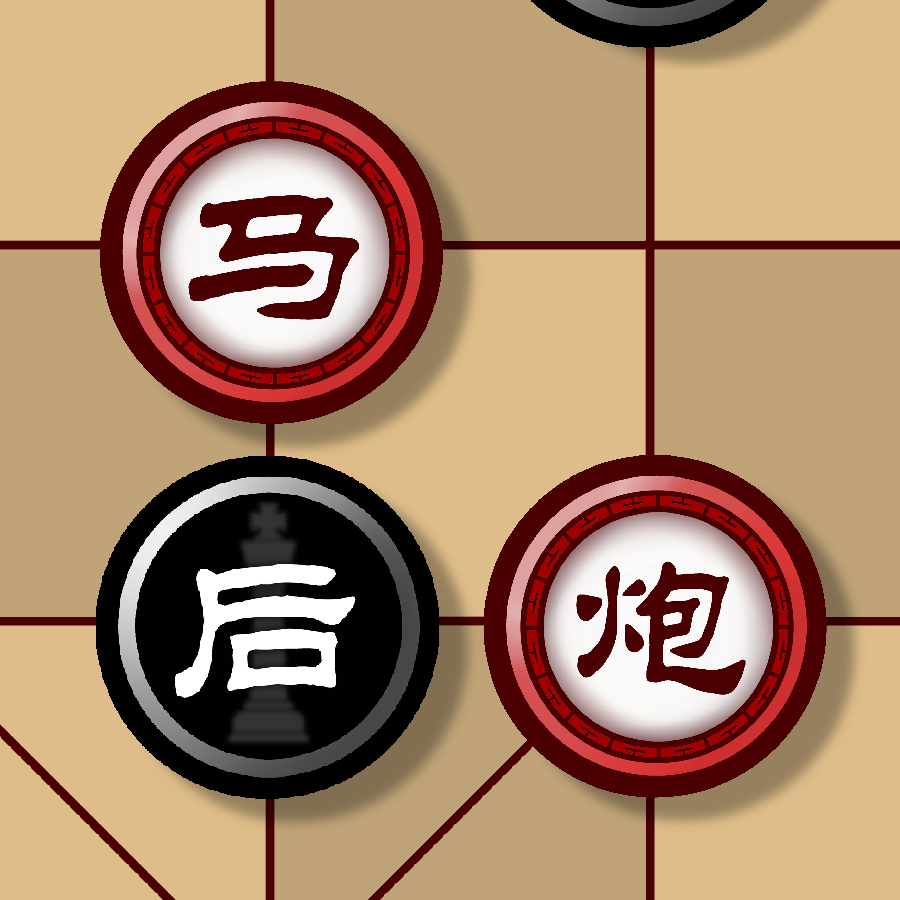
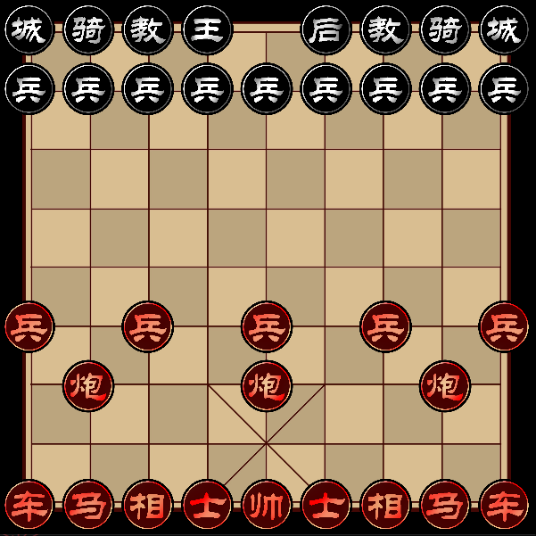
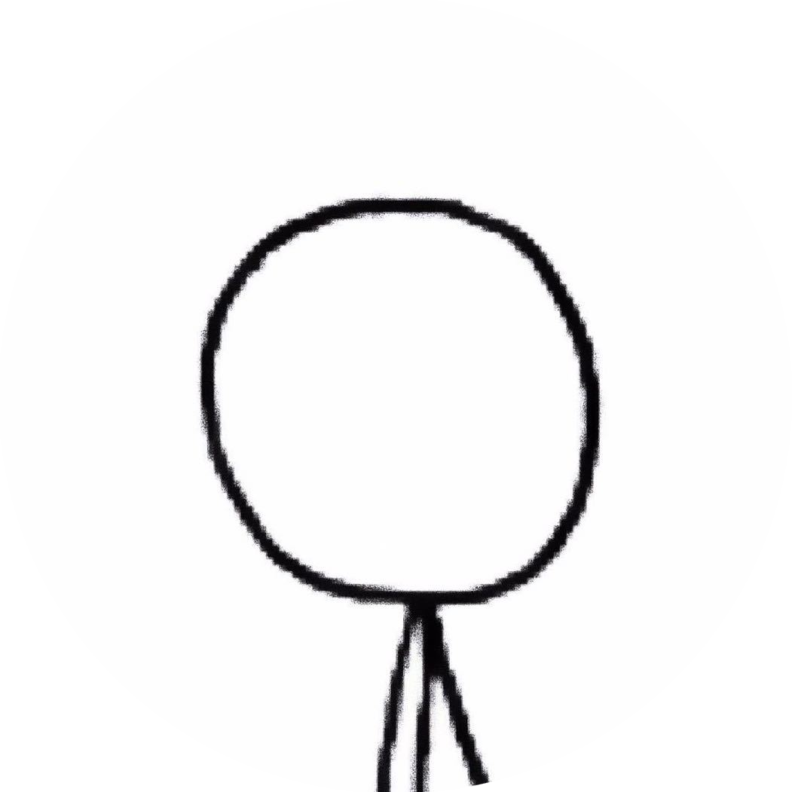

# BingGo

  <a href="https://github.com/windbelljianjie0711/BingGo/README.md">中文</a> · 
  <a href="https://github.com/windbelljianjie0711/BingGo/README_tech.md">TECH</a>

Bing Go! Combining Chinese chess with chess, in the 9*9 chess game,  
Witness the battle of world blending and the feast of cultural blending together!

  

<h3 align="center">BingGo</h3>

the magical integration with Chinese chess and International chess

[
**Explore Files »**
](#Contents)

  <a href="https://github.com/windbell0711/BingGo">View Demo</a>  ·
  <a href="https://github.com/windbell0711/BingGo/issues">report Bug</a>  ·
  <a href="https://github.com/windbell0711/BingGo/issues">Suggestions</a>

 
## Contents
- [Rules](#Rules)
  - [Changes](#Changes)
  - [Details](#Details)
- [Download](#Download)
- [Developers](#Developers)
- [Know-how](#Know-how)
- [Copyright](#Copyright)

## Rules
### Changes
The game largely follows the movement and victory rules of Chinese chess (Xiangqi) 
or chess, with the following primary modifications:
1. The initial state of the board is as shown in the diagram below, measuring
9x9 squares, with each side placing Chinese chess pieces and International chess pieces, respectively.

2. Due to the expanded battlefield, an additional pawn is added to the International chess set.
3. An additional cannon is added to the Chinese chess set.
4. The movement range restrictions for the advisors and elephants in Chinese chess are removed.
5. In Chinese chess, a pawn can move one step forward, left, or right after advancing one step forward.
6. Added Chinese chess piece **Marshal**

### Details

The game starts with the Chinese chess side, and each side takes turns moving once according to the following methods

#### For the Chinese Chess Side:
- **General**: Moves one square along a straight line and cannot leave the palace. If directly facing the King and at the start of its turn, it wins.
- **Advisor**: Moves one square diagonally.
- **Elephant**: Moves two squares diagonally and cannot jump over any piece.
- **Horse**: Moves one square along a straight line, then moves one square diagonally outward; it cannot jump over any piece if there is one on the path.
- **Chariot**: Moves any number of squares along a straight line and cannot jump over any piece.
- **Cannon**: Moves any number of squares along a straight line and cannot jump over any piece or capture in this way. It can capture an enemy piece if there is exactly one piece between it and the enemy piece.
- **Soldier**: Moves one square forward, left, or right. Upon reaching the end of the board, it can immediately transform into a **marshal**.
- **Marshal**: Moves in any of the above ways

#### For the Chess Side:
- **King**: Moves one square in any direction, either diagonally or straight. If the king is on the back rank and the rook is in its original position, the king can castle by moving two squares towards the rook, which then moves to the square next to the king.
- **Queen**: Moves any number of squares along a diagonal or straight line and cannot jump over any piece.
- **Rook**: Moves any number of squares along a straight line and cannot jump over any piece.
- **Bishop**: Moves any number of squares diagonally and cannot jump over any piece.
- **Knight**: Moves two squares in one direction and then one square perpendicular to that direction, jumping over any intervening pieces.
- **Pawn**: Moves one square forward, or two squares forward from its starting position, but cannot capture in this way. It can capture an enemy piece that is one square diagonally ahead. Upon reaching the end of the board, it can immediately transform into a queen.
## Download

## Developer
<a href="https://github.com/windbell0711/Lilold333">@Lilold</a>
 
<a href="https://github.com/windbell0711/windbell0711">@windbell0711</a>

## Know-how
Whether you are a developer or a user, you are very welcome to check our [Files](README_tech.md)！

## Copyright
[Apache 2.0](LICENSE) used.
